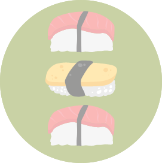

  

<h1 align="center">Sushi</h1>

## Description

Sushi is a simple REST API. Future development will include a frontend where the user can create their own sushi rolls, update or delete them 🍱

## Built With

- Express.js
- Mongoose
- Node.js

## Contribution

Made with ❤️ by Nicole Barranca

## Questions

Feel free to contact me directly at nikkibarranca@gmail.com if you have any questions about the repo.

You can find more of my work at [Nicole Barranca](https://github.com/NicoleBarranca).
